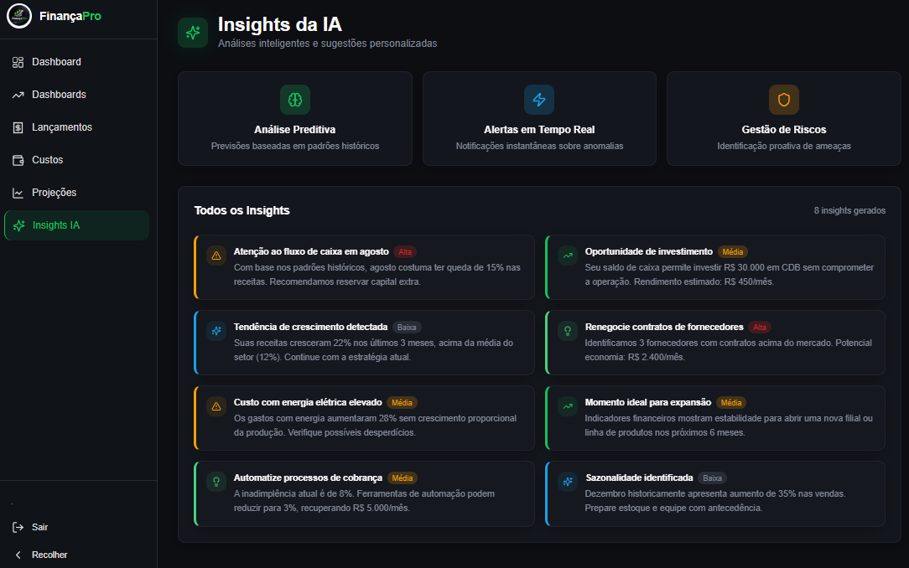
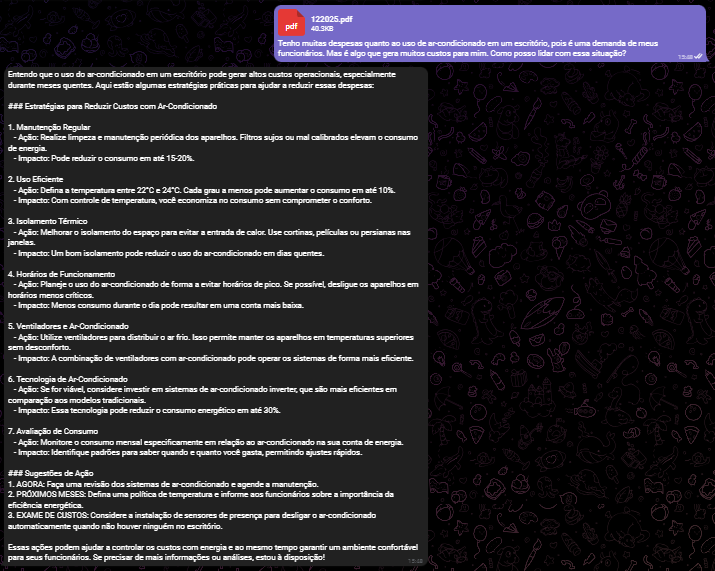
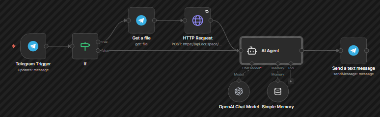

# 💰 FinançaPro - AI Financial Assistant Agent

  

> **3º Lugar no Hackathon Academ.IA / Vibecoding 2026** 🏆
> *Solução de IA para análise financeira e previsibilidade de fluxo de caixa para PMEs.*

## 🎯 O Projeto

O **FinançaPro** é uma solução desenvolvida para auxiliar pequenas e médias empresas a terem clareza sobre seus dados financeiros. Através de um agente de IA, o sistema ingere documentos (PDFs, imagens) e mensagens de texto, estrutura esses dados e fornece insights estratégicos para tomada de decisão.

Este repositório contém a **Lógica de Backend e Automação (AI Agent)** desenvolvida por mim, que serviu como o "cérebro" por trás da interface web.

*(Interface do protótipo apresentada no Pitch)*

## 📱 Demonstração em Tempo Real (PoC)

Para validar a funcionalidade do backend, utilizamos o **Telegram** como interface de chat direta com o sistema. A imagem abaixo comprova o **Agente de IA em operação**, demonstrando sua capacidade de receber inputs (arquivos ou texto), processar a intenção do usuário e retornar análises financeiras complexas instantaneamente.

*(Interação real: O Agente processando dados e retornando insights)*

## ⚙️ Arquitetura da Solução (Minha Contribuição)

O core da inteligência foi construído utilizando **n8n** para orquestração de fluxos e integração com LLMs (Large Language Models).

**Fluxo de Trabalho:**
1.  **Ingestão (Telegram Trigger):** Captura mensagens de texto e arquivos enviados pelo gestor.
2.  **Processamento (OCR & Parsing):** O fluxo identifica se há anexos (faturas, planilhas), extrai o texto via OCR.
3.  **Análise Cognitiva (AI Agent):** Um Agente de IA com *System Prompt* especializado em finanças analisa os dados brutos.
    * *Capacidades:* Identificação de riscos, sugestão de investimentos e categorização de despesas.
4.  **Saída:** Retorna insights estruturados para o Dashboard ou resposta direta via chat.

## 🛠️ Tecnologias Utilizadas

* **Orquestração:** [n8n](https://n8n.io/)
* **IA Generativa:** Integração via API (OpenAI/Gemini) para análise de contexto.
* **OCR:** Processamento de documentos financeiros digitalizados.
* **Mensageria:** Telegram API (para interface de chat rápido).

## 🚀 Como Executar (O Workflow)

Este é um arquivo de fluxo do n8n. Para testar ou estudar a lógica:

1.  Instale o [n8n](https://docs.n8n.io/).
2.  Importe o arquivo `workflows/FinancaPro_Workflow.json` na sua interface.
3.  Configure as credenciais (OpenAI API Key, Telegram Bot Token).
4.  Ative o workflow.

## 👥 Equipe e Créditos

Este projeto foi idealizado e desenvolvido em equipe durante o Hackathon Academ.IA.

* **João Guilherme (Eu):** AI Agent Development, n8n Workflow & Backend Logic.
* **[Nome do Colega 1]:** Frontend (Lovable) & UI/UX.
* **[Nome do Colega 2]:** Pitch & Business Modeling.
* **[Nome do Colega 3]:** Data Analysis.

---
*Disclaimer: Este projeto é um MVP (Minimum Viable Product) desenvolvido em ambiente de competição (Hackathon). O código reflete uma implementação ágil para validação de ideia.*
